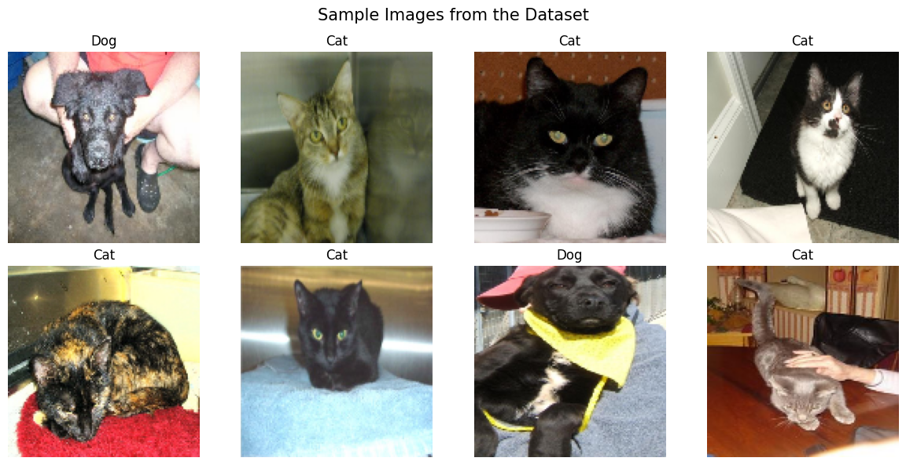
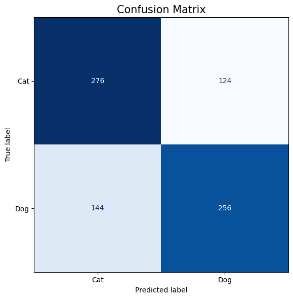
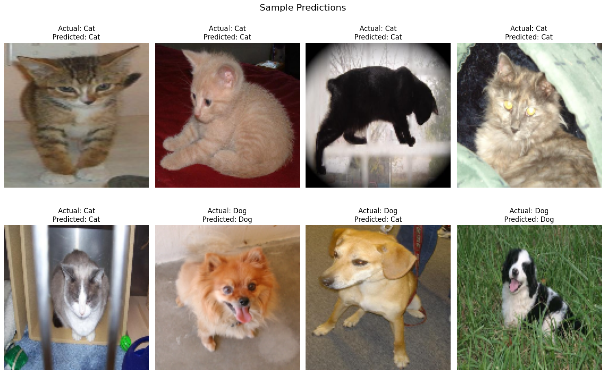

###### 🐱🐶 Cats vs Dogs Image Classification using Support Vector Machine (SVM)

&#x20;   This project was developed as Task 03 of my **Machine Learning Internship** at **SkillCraft Technology.**

The objective is to classify images of cats and dogs using a **Support Vector Machine (SVM)** with **Histogram of Oriented Gradients (HOG)** feature extraction. Instead of using raw pixel values, HOG features capture important edge and shape information, making the model more effective for classical machine learning.

###### 📌Project Overview

* Loaded the Kaggle Dogs vs Cats dataset.
* Used 2,000 cat images and 2,000 dog images.
* Skipped corrupted images automatically.
* Resized all images to 128 × 128 pixels.
* Converted images to grayscale.
* Extracted HOG features.
* Split the dataset into training and testing sets.
* Trained a Linear SVM classifier.
* Evaluated the model using accuracy, classification report, and confusion matrix.
* Displayed sample predictions.
* Saved the trained SVM model using Joblib.

###### 

###### 🛠 Technologies Used

* Python
* OpenCV
* NumPy
* Matplotlib
* Scikit-learn
* Scikit-image
* Joblib

###### 📂 Dataset

* Kaggle Dogs vs Cats Dataset

This project uses the **Dogs vs Cats** dataset available on Kaggle.

Dataset: https://www.kaggle.com/datasets/shaunthesheep/microsoft-catsvsdogs-dataset

The dataset is **not included** in this repository due to its large size. Please download it from Kaggle and update the dataset path in the notebook before running the project.

###### Dataset Structure:

PetImages/

├── Cat/

└── Dog/

###### 🔄 Machine Learning Workflow

* Load Images
* Image Preprocessing
* HOG Feature Extraction
* Train-Test Split
* Train Linear SVM
* Model Evaluation
* Visualize Predictions
* Save Trained Model

###### 🖼 Sample Images

###### 📊 Confusion Matrix

###### 🔍 Sample Predictions

###### 📈 Results

The model was evaluated using:

* Accuracy Score
* Classification Report
* Confusion Matrix
* Sample Prediction Visualization

The exact accuracy may vary slightly because images are randomly selected from the dataset.

###### 📁 Project Files

* cat\_vs\_dog.ipynb
* README.md
* requirements.txt
* svm\_cat\_dog\_model.pkl
* sample\_images.png
* confusion\_matrix.png
* sample\_predictions.png

###### 🚀 Future Improvements

* Train on the complete dataset
* Compare multiple SVM kernels
* Experiment with different HOG parameters
* Compare with CNN-based image classification models

###### 💼 Internship

**SkillCraft Technology – Machine Learning Internship**

Task 03: Implement a Support Vector Machine (SVM) to classify images of cats and dogs using the Kaggle Dogs vs Cats dataset.

###### 👨‍💻 Author

&#x20;G AmruthaRaju

